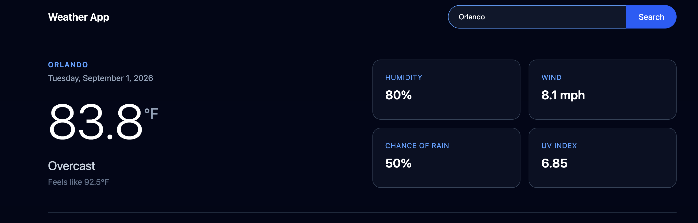
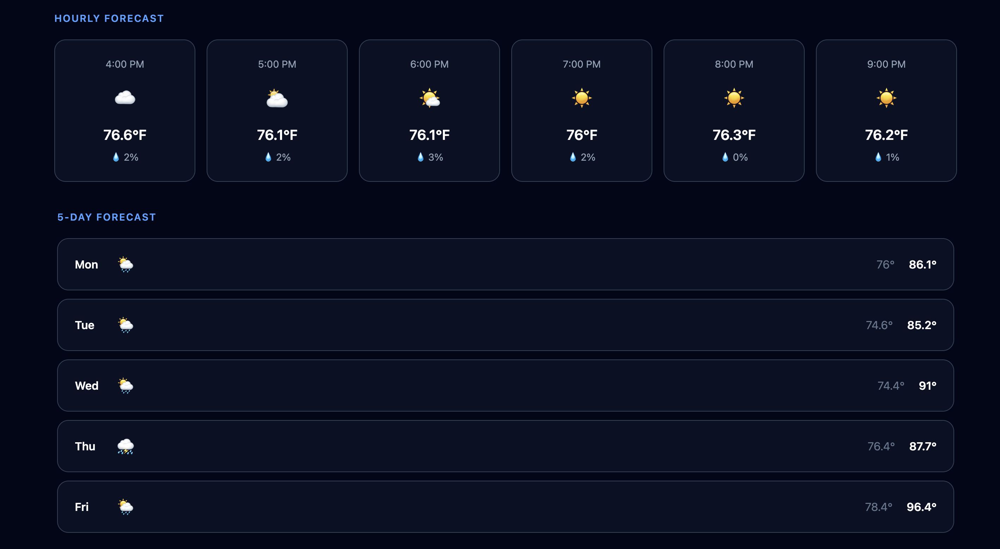

# Weather App

A responsive weather application built with React and Tailwind CSS that allows users to search for a city and view current weather conditions, hourly forecasts, and a 5-day forecast.

 

## Project Goals

The goal of this project was to build a responsive weather application while practicing React fundamentals, API integration, state management, and dynamic rendering of data.

## Features

* Search for weather by city
* Display current temperature and "feels like" temperature
* Show current weather conditions with dynamic icons
* Display the current date
* View a 6-hour hourly forecast
* Show hourly precipitation probability
* View a 5-day forecast with daily high and low temperatures
* Dynamic weather descriptions based on weather conditions
* Responsive design for different screen sizes
* Error message when a location cannot be found

## Technologies Used

* React
* JavaScript
* Tailwind CSS
* Vite
* Open-Meteo API
* Open-Meteo Geocoding API
* HTML
* Git & GitHub

## APIs & Data

This project uses the Open-Meteo APIs to retrieve weather and location data.

### Weather API

The Open-Meteo Weather API provides:

* Current temperature
* Feels-like temperature
* Weather conditions
* Humidity
* Wind speed
* Hourly temperature
* Hourly precipitation probability
* Daily high and low temperatures
* Daily weather conditions
* UV index

### Geocoding API

The Open-Meteo Geocoding API converts a user's city search into latitude and longitude coordinates. These coordinates are then used to request weather data for the selected location.

## How It Works

1. The user enters a city name into the search bar.
2. The Geocoding API searches for the city and returns its latitude and longitude.
3. The coordinates are added to the Weather API request.
4. The Weather API returns current, hourly, and daily weather data.
5. React stores the weather data in state using `useState`.
6. The application uses the weather codes returned by the API to display readable weather descriptions and dynamic icons.
7. The forecast sections update automatically based on the selected location.

## What I Learned

Building this project helped me practice working with React, APIs, and dynamic data.

* Fetching and working with data from external APIs
* Using `useState` to manage application state
* Using `useEffect` to handle API requests
* Working with asynchronous JavaScript and promises
* Using conditional rendering to safely display API data
* Mapping through API data to create reusable forecast cards
* Converting weather codes into readable descriptions and icons
* Working with dates and formatting them for display
* Building responsive layouts with Tailwind CSS
* Debugging API and React errors using browser developer tools
* Using Git and GitHub to track project changes

## Future Improvements

* Add a loading state while weather data is being retrieved
* Add a "Use My Location" feature using browser geolocation
* Add a Fahrenheit/Celsius toggle
* Add more detailed weather icons and animations
* Add sunrise and sunset information
* Improve error handling for API and network errors
* Add additional weather details such as humidity, wind, and UV index

## Live Demo 

